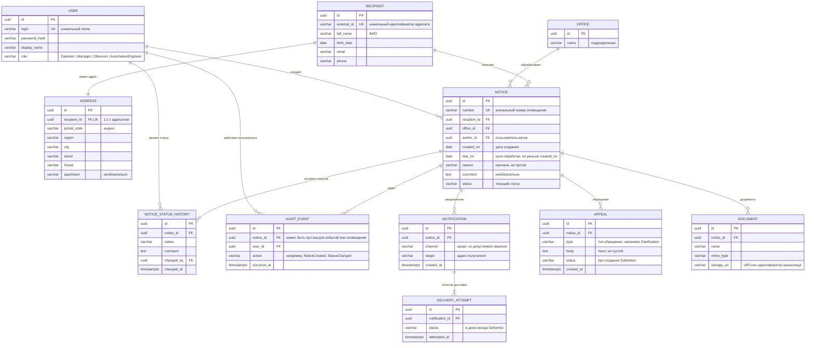

Диаграмма построена по разделу 6 [`docs/system-requirements.md`](system-requirements.md).

> **Что подтверждено, а что нет.** Названия сущностей, их связи и перечисленные атрибуты следуют из бизнес-требований и use cases. Суррогатные ключи `id`, внешние ключи, типы данных и `NOT NULL` не заданы в источниках — это **предложение** для проектирования схемы PostgreSQL. Статусы и их перечень пока не определены, поэтому они показаны как строки.

## Пояснения к связям

| Связь | Кратность | Обоснование |
|---|---|---|
| Recipient — Address | 1 : 1 | UC-01: создаются записи `Recipient` и `Address`, адрес вложен в адресата |
| Recipient — Notice | 1 : 0..N | Адресат может получить несколько оповещений; оповещение всегда имеет адресата (БП-5) |
| Office — Notice | 1 : 0..N | При создании оповещения подразделение должно существовать (БП-5) |
| Notice — NoticeStatusHistory | 1 : 1..N | При создании оповещения сразу пишется начальная запись истории (UC-02) |
| Notice — AuditEvent | 1 : 0..N | Аудит пишется при создании и смене статуса (UC-02, UC-05) |
| Notification — DeliveryAttempt | 1 : 1..N | Каждое уведомление сразу получает попытку доставки со статусом `Delivered` (UC-06) |
| Notice — Notification / Appeal / Document | 1 : 0..N | Привязываются к оповещению (UC-06, UC-07, UC-08) |
| User — Notice / StatusHistory / AuditEvent | 1 : 0..N | Автор оповещения, автор смены статуса, субъект аудита; в UC это «автор» и «аудит действий пользователей» |

## Ограничения, которые не видны на диаграмме

- `RECIPIENT.external_id` и `NOTICE.number` уникальны (БП-1, БП-2).
- `NOTICE.due_on >= NOTICE.created_on` (БП-3), `NOTICE.reason <> ''` (БП-4), `APPEAL.body <> ''` (БП-8) — проверки на уровне CHECK или приложения.
- Новый статус оповещения не равен текущему (БП-6) — проверяется в приложении.
- `NOTICE_STATUS_HISTORY` и `AUDIT_EVENT` только добавляются, без изменения и удаления (SR-STS-05).
- Допустимые значения `NOTIFICATION.channel` и `APPEAL.type` не определены (БТ §7).

## Что стоит подтвердить

1. **`USER` и связь с оповещением.** UC говорят, что автор передаётся во входных данных оповещения. В системных требованиях предложено брать его из JWT (SR-NTC-09). На диаграмме автор — внешний ключ на `USER`.
2. **`AUDIT_EVENT.notice_id`.** В UC аудит описан только для действий над оповещениями. Поле допускает пустое значение на случай событий вне оповещений (например, создание учётной записи). Если такие события не нужны, поле можно сделать обязательным.
3. **Статусы** — отдельный справочник (`STATUS`) или строковое поле. Пока перечень не согласован, выбрана строка; если статусов станет много или им понадобятся свойства, лучше завести справочник.
4. **Один адрес на адресата.** Источники описывают «вложенный адрес», поэтому выбрана связь 1:1. Если адресату нужно несколько адресов, связь станет 1:N.
